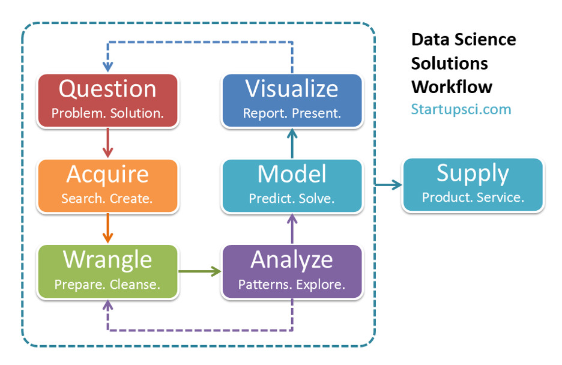
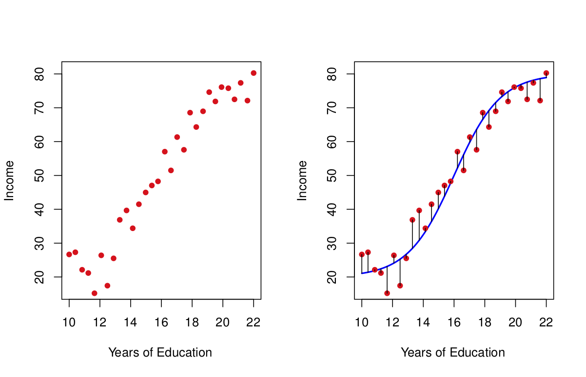

```{r,message=FALSE,warning=FALSE,echo=FALSE}
library(tidyverse)
library(ISLR)
```

# Introduction 

If you recall from our earlier discussion, modeling is a key component in the basic data science workflow:
{width=60%}

We have also seen example data sets where a model based on the data may help us to answer specific questions. 

There are several common key steps in the modeling process that we will cover in this course:

1) **Model training** which is also called model fitting or parameter estimation. This typically involves implementing some kind of training algorithm. 
2) **Model validation.** At this stage we assess the accuracy of the model and determine how useful is the model in making predictions on previously unseen data, that is data that is not used in training the model. 
3) **Model selection,** feature selection, and hyperparameter tuning. Here the concern is to determine among a set of competing model choices, or a set of competing variables which should be used for the application we are interested in. 

**Note:** There are often also preprocessing steps involved in the modeling process. This is includes transforming the data, *e.g.* centering or scaling some variables, dimension reduction, etc. We will come back to these topics later, usually in specific contexts. 

# Introduction to Supervised Learning

In this section we will follow Chapter 2 from [An Introduction to Statistical Learning](http://faculty.marshall.usc.edu/gareth-james/ISL/) but Chapter 2 of [Elements of Statistical Learning](https://web.stanford.edu/~hastie/ElemStatLearn/) is also highly recommended. 

In **supervised learning** our data is formatted so that there is a response variable $Y$ and one or more predictor variables collectively denoted as $X$. We assume that there is a relationship between the response $Y$ and predictor(s) $X$ of the form

$Y = f(X) + \epsilon,$

where $f$ is some fixed but unknown function (often from a specific family of functions that are uniquely determined by some set of parameters) and $\epsilon$ is a random error term which is indepedent of $X$ and has zero mean (or expected value). The error term may be thought of as representing inherent uncertainty that is inevitable in most practical applications. 

## Examples

Consider the following data:
```{r}
linear_df <- data.frame(x=rnorm(45,mean=2,sd=3.5))
linear_df <- linear_df %>% mutate(y=2*x+3+rnorm(45,sd=2))
linear_df %>% ggplot(aes(x=x,y=y)) + geom_point()
```

We might suppose that 

$Y = mX + b + \epsilon,$

that is, we assume that there is a **linear** relationship between the response and predictor.  

As another example, consider the data represented in the left side of the following figure:


We might suppose that 

$Y = f(X) + \epsilon,$

where $f$ is some **polynomial** function. 

**Note:** In both of the previous examples, the response variable was continuous. It may be the case, as with the iris data set that the response variable is categorical. 


## The Supervised Learning Problem

In supervised learning, the task is, given an assumed model $Y = f(X) + \epsilon$ to **approximate** $f$ with a function $\hat{f}$ such that 

$\hat{Y} = \hat{f}(X),$ 

represents a **prediction** $\hat{Y}$ corresponding to $X$ for $Y$. 

**Note:** The difference $Y - \hat{Y}$ is often called the *error* or *residual*.  

Let's illustrate this in the context of the two examples:

For the first example we might have $\hat{f}$ be the linear function whose graph (the line) is shown below, 
```{r}
linear_df %>% ggplot(aes(x=x,y=y)) + geom_point() + 
  geom_smooth(method = "lm",se=FALSE)
```
and the $y$-values along the line make up the predictions $\hat{y}$ corresponding to the $y$-values in the data points. 

We can plot the errors or residuals with
```{r}
y_hats <- predict(lm(y~x,data=linear_df))
linear_df %>% ggplot(aes(x=x,y=y)) + geom_point() + 
  geom_smooth(method = "lm",se=FALSE) + 
  geom_segment(aes(xend = x, yend = y_hats))
```
Later we will see that the overall sum of each of the residuals squared provides a measure of how well the model performs in terms of predicting the observed data. 


For the second example, tn the right of the following figure,


the $y$-values along the curve  make up the predictions $\hat{y}$ corresponding to the $y$-values in the data points. The corresponding residuals are also shown. 

There three questions:

1) Why estimate $f$?
2) How is the estimate $\hat{f}$ constructed? 
3) How accurate are the predictions made using the estimate $\hat{f}$?

This is the problem of **supervised learning.**

## Why Estimate $f$?

There are two main reasons for estimating $f$:

1) Prediction - Here the goal is to determine likely response values (at least approximately) in cases where the predictor values are known but the corresponding (distribution of) response values can not be measured directly. 

2) Inference - Here the goal is to understand the nature of the specific relationship between the response $Y$ and the predictor(s) $X$. 

A key distinction between prediction and inference is that with prediction, the specific form of $\hat{f}$ is not important, only the degree of accuracy of resulting predictions. On the other hand, the specific form of $\hat{f}$ does matter in problems of inference. 

While the main focus of this course is on problems of prediction, we will now pause to briefly review some concepts from basic statistics and (re-)examine inference in that context. 

After our study of statistical inference, we will come back to model fitting (training) and evaluation and then discuss some ideas from unsupervised learning. All of this will be covered in further notebooks. 
