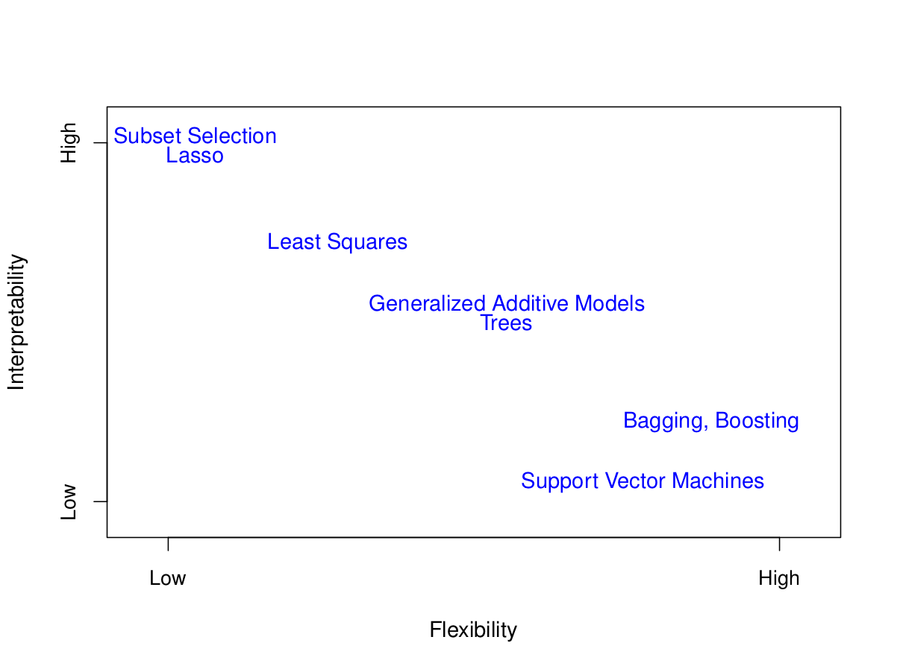
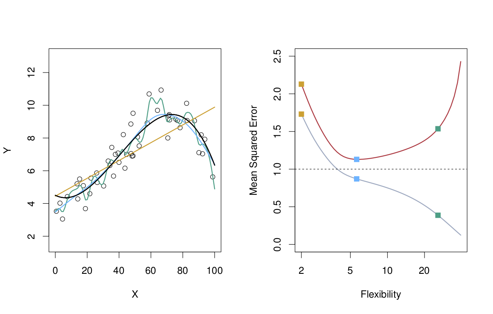

```{r,warning=FALSE,message=FALSE}
library(tidyverse)
library(broom)
library(caret)
library(boot)
```

# Introduction 

For supervised learning models, either regression or classification, the basic idea behind model fitting is very simple: select the model $\hat{f}$ (either by choosing parameter values in the parametric case or some quality of the model like smoothness in the non-parametric case) whose structure is such that the error between the known response values in the data and the response values predicted by the model is minimized. In the regression setting (continuous response variable) error is measured by **mean squared error**

$\text{MSE} = \frac{1}{n}\sum_{i=1}^{n}(y_{i} - \hat{f}(x_{i}))^2,$

and in the classification setting error is measured by the **classification error rate**

$\text{CER}=\frac{1}{n}\sum_{i=1}^{n}I(y_{i}\neq\hat{f}(x_{i})),$

(intuitively this is the proportion of response values in the data that are misclassified by the model). 

Why is this not the end of the story when it comes to model fitting? There are three primary considerations that force us to think beyond straightforward error minimization when it comes to model fitting:

1) There is a trade-off between the flexibility of a modeling approach and how easy it is to interpret the meaning of the model. 



This is more of a pragmatic problem than a foundational problem. In the physical sciences it is usually essential than a model have an interpretation directly related to On the other hand, in business applications one may not be too concerend with what the model is telling you on some base level but only that the model provide a reasonable solution the problem of interest.    


2) There is the problem of **overfitting**, that is, a commonly occurring phenomena where models that do an exceptional job of predicting the correct responses on the **training data** may perform poorly with inaccurate predictions on previously unseen **test data**. 




3) There is a well-known trade-off between **bias** and **variance**. This is called the **bias-variance trade-off**. In this context bias refers to the consequences (in terms of error) of using a potentially simple $\hat{f}$ to approximate a potentially complex process (in some ways this is related to model flexibility), while variance characterizes the change that we would observe if $\hat{f}$ was estimated using different (but similar) data. As an example, a linear model would possesses relatively high bias but relatively low variance compared with a highly non-linear model. 

Techniques such as **cross-validation** and the **bootstrap** can be used to assess the performance of a model and determine if there is too much overfitting or variance. For example, cross-validation can be used to estimate the **test error** associated with a given model method, or to select the appropriate level of flexibility, while the bootstrap can be used to provide a measure of accuracy of a given model. 

**Important point:** In a perfect world we would have a highly accurate model that is easy to interpret, does a good job in generalizing to new data (*i.e.* doesn't overfit), has low bias, and has low variance. The point is that this is impossible because a model that does well in one of the areas of accuracy, interpretability, generalizability, low bias, or low variance automatically does less well in one or more of the other areas. 

In practice it has become straightforward to fit or train a particular type of model because R, Python, and other programming environments provide easy to use implementations of many common training algorithms. For example, in R there is a simple function lm() for training a linear model. Furthermore, the R package [caret](http://topepo.github.io/caret/index.html) and the Python package [scikit-learn](https://scikit-learn.org/stable/) make it relatively easy to conduct cross-validation and model performance assessment. This article provides [a short introduction to caret](https://cran.r-project.org/web/packages/caret/vignettes/caret.html) while [this page](https://www.analyticsvidhya.com/blog/2016/12/cheatsheet-scikit-learn-caret-package-for-python-r-respectively/) provides cheatsheets for caret and sci-kit learn. 

Later we will see many examples of model training and evaluation in R and explore some aspects of the caret package in relation to carrying out these tasks. For now, we will develop a deeper understanding of the fundamental concepts of model training and evaluation using some specific modeling approaches beginning with simple linear regression. 

# Introduction to Linear Regression 

Chapter 3 of [An Introduction to Statistical Learning with Applications in R](http://faculty.marshall.usc.edu/gareth-james/ISL/ISLR%20Seventh%20Printing.pdf) is a highly useful reference for the material we will discuss here. 

## Simple Linear Regression

In simple linear regression we have two variables, one quantitative predictor variable $x$ and one quantitative response variable $y$. Then we assume that

$y = mx + b + \epsilon,$

and we seek to find parameter (or coefficient) values $\hat{m}$ and $\hat{b}$ such that

$\hat{y} = \hat{m}x + \hat{b},$

provides a "good" estimate for $y$. The values $\hat{m}$ and $\hat{b}$ are determined by the method of least squares. Let's look at an example. 

### Simulated Linear Data

Consider the following data:
```{r}
linear_df <- data.frame(x=rnorm(45,mean=2,sd=3.5))
linear_df <- linear_df %>% mutate(y=2*x+3+rnorm(45,sd=2))
linear_df %>% ggplot(aes(x=x,y=y)) + geom_point()
```

We will write a function that inputs values for the  coefficients $m$ and $b$ and resturns the *residual sum of squares*

$\text{RSS} = \sum_{i=1}^{n}(y_{i} - \hat{y}_{i})^2.$

Here is our residual sum of squares function:
```{r}
return_rss <- function(coeffs,data=linear_df){
  m <- coeffs[2]
  b <- coeffs[1]
  y_hat <- m*linear_df$x + b
  rss <- sum((linear_df$y - y_hat)^2)
}
```

Let's compute some different residual sum of square values:
```{r}
(return_rss(c(1,1)))
```

In order to determine $\hat{m}$ and $\hat{b}$, we will minimize the residual sum of squares function with respect to the coefficient values $m$ and $b$. In R this can be done with the optim() function:
```{r}
optim(c(1,1),return_rss)$par
```

## The lm() Function 

There is a built-in function in R called lm() that does all of the work of fitting a linear model for us. Furthermore, lm() returns a lot of useful information regarding the fit and there are functions such as coefficients() that provide easy access to this information. The R package broom contains three functions that tidy the outout from lm and provide additional information:

1) tidy() tidies the lm fit output
2) glance() return a tibble with summary statistics for a linear fit
3) augment() adds linear fit information such as residuals to the data the model is fit to

### Example

Use lm() to obtain a linear fit
```{r}
lm_fit <- lm(y~x,data=linear_df)
```

Obtain the estimated coefficient values:
```{r}
coefficients(lm_fit)
```

**Question:** How does this result compare with what we obtained before when we "manually" optimized the RSS function? 

Let's call the three broom functions on our linear fit:
```{r}
tidy(lm_fit)
```

Notice that in addition to the estimated values for $\hat{m}$ and $\hat{b}$ we also get standard errors, sample statistic values, and p-values. We will return later to a discussion of the meaning and use of the standard errors, sample statistic values, and p-values. We note that these are mostly play a role in inference and are not as important in prediction. 

Now for glance:
```{r}
glance(lm_fit)
```

This returns additional statistics, these tell us about the goodness of fit for our linear model. We note here that the [AIC](https://en.wikipedia.org/wiki/Akaike_information_criterion) and [BIC](https://en.wikipedia.org/wiki/Bayesian_information_criterion) values are useful metrics related to model selection and avoiding overfitting. Again, these are topics we will return to later. 

Finally, let's call augment:
```{r}
lm_fit_aug <- augment(lm_fit)
head(lm_fit_aug)
```

There is a lot of information here. For now, take these points in mind:

1) This is a tibble
2) It contains the original data
3) It contains the values for $\hat{y}$ (.fitted)
4) It contains the residuals $y-\hat{y}$ (.resid)

It is easy to obtain the RSS from the tibble return by augment, for example,
```{r}
sum((lm_fit_aug$.resid)^2)
```
and compare this with
```{r}
(return_rss(coefficients(lm_fit)))
```

The tibble produced by a call to augment is very useful for producing plots:
```{r}
lm_fit_aug %>% ggplot() + 
  geom_point(aes(x=x,y=y)) + 
  geom_line(aes(x=x,y=.fitted),color="blue")
```

A very commonly used diagnostic plot for linear regression is to plot residuals versus fitted values:
```{r}
lm_fit_aug %>% ggplot(aes(x=.fitted,y=.resid)) + 
  geom_point() + 
  geom_hline(yintercept = 0)
```

We will talk more about the significance of this plot later but for now just know that we are looking for the residuals to be symmetrically distributed in the vertical direction with constant variance. 

Finally, note that we can plot a linear fit along with the corresponding confidence intervals with
```{r}
linear_df %>% ggplot(aes(x=x,y=y)) + geom_point() + 
  geom_smooth(method="lm")
```

It is possible to reproduce this using the output from augment as follows:
```{r}
lm_fit_aug %>% ggplot(aes(x=x,y=y)) + 
  geom_line(aes(x=x,y=.fitted-2*.se.fit)) + 
  geom_line(aes(x=x,y=.fitted+2*.se.fit)) + 
  geom_ribbon(aes(ymin = .fitted-2*.se.fit, ymax = .fitted+2*.se.fit), fill = "grey70") + 
  geom_point(aes(x=x,y=y)) + 
  geom_line(aes(x=x,y=.fitted),color="blue")
```

## The predict() Function

Once we have fitted a model, we can use the predict() function to apply the fitted model to a new data point. For example, suppose we want to find the $\hat{y}$ predicted by the model when $x=-5$, then we simply use
```{r}
(y_hat_pred<-predict(lm_fit,new=data.frame(x=c(-5))))
```

Let's plot this on our previous plot:
```{r}
lm_fit_aug %>% ggplot(aes(x=x,y=y)) + 
  geom_line(aes(x=x,y=.fitted-2*.se.fit)) + 
  geom_line(aes(x=x,y=.fitted+2*.se.fit)) + 
  geom_ribbon(aes(ymin = .fitted-2*.se.fit, ymax = .fitted+2*.se.fit), fill = "grey70") + 
  geom_point(aes(x=x,y=y)) + 
  geom_line(aes(x=x,y=.fitted),color="blue") + 
  geom_point(data=NULL,aes(x=-5,y=y_hat_pred),size=2,color="red")
```

The predict function is useful for examining the prediction or approximation error on previously unseen data, that is data other than what was used to fit the model. 

Let's simulate some more data, use the model to estimate the response, and compare the predicted values with the data values:
```{r}
linear_df_new <- data.frame(x=rnorm(10,mean=2,sd=3.5))
linear_df_new <- linear_df_new %>% mutate(y=2*x+3+rnorm(10,sd=2)) # generated by same process as before
y_hat_pred_more <- predict(lm_fit,new=linear_df_new) 
linear_df_new <- linear_df_new %>% mutate(pred_vals = y_hat_pred_more)
```

Let's take a look at the first few rows of this result:
```{r}
head(linear_df_new)
```


Let's plot the result:
```{r}
linear_df_new %>% pivot_longer(cols=c(y,pred_vals)) %>% 
  ggplot(aes(x=x,y=value,color=name,shape=name)) + 
  geom_point(size=2)
```
and we can calculate the (test) MSE for the new data:
```{r}
with(linear_df_new,sum((y-pred_vals)^2)/nrow(linear_df_new))
```
**Observation:** If we generate more new data and redo this the prediction and recompute the MSE we will get something different. What do you boserve from this behavior? 

**Note:** Later on we will see a method for using the "training data" to estimate the (test) MSE for new data.   

Let's compare this with the mean square error of the original data used to fit the model:
```{r}
sum((lm_fit_aug$.resid)^2)/nrow(lm_fit_aug)
```

## Bootstrap Standard Error

It is worth noting that we can use the bootstrap to approximate the standard error values return as the column .se.fit in the call to augment(). 

```{r}
N <- 5000

boot_fit <- function(data,id){
  resamp_df <- data[id, ]
  re_fit <- lm(y~x,data=resamp_df)
  predict(re_fit,data)
}

boot_result <- boot(linear_df,boot_fit,R=N)

```


```{r}
boot_se <- apply(boot_result$t, MARGIN=2, FUN = sd)
```


```{r}
lm_fit_aug %>% mutate(boot_se=boot_se) %>% select(.se.fit,boot_se) %>% head()
```

Let's compare the result in a plot:
```{r}
lm_fit_aug <- lm_fit_aug %>% mutate(lower=.fitted-2*boot_se,upper=.fitted+2*boot_se)
lm_fit_aug %>% ggplot(aes(x=x,y=y)) + 
  geom_ribbon(aes(ymin = .fitted-2*.se.fit, ymax = .fitted+2*.se.fit), fill = "grey70") + 
  geom_point(aes(x=x,y=y)) + 
  geom_line(aes(x=x,y=.fitted),color="blue") + 
  geom_errorbar(aes(x=x,ymin=lower,ymax=upper),color="red")
```
Our bootstrap standard errors do pretty well. 

## Inference for Regression

The most common inferential problem for simple linear regression is that of confidence intervals and significance tests for the slope parameter $m$. Here we will apply the bootstrap and permutation test to do this for our example data. 

### Bootstrap standard error for $m$

```{r}
N <- 5000

get_coefficients <- function(data,id){
  resamp_df <- data[id, ]
  re_fit <- lm(y~x,data=resamp_df)
  coefficients(re_fit)
}

boot_coeffs_result <- boot(linear_df,get_coefficients,R=N)
```

Plot the bootstrap distribution for $m$:
```{r}
boot_coeffs_df <- as.data.frame(boot_coeffs_result$t)
names(boot_coeffs_df) <- c("b","m")
boot_coeffs_df %>% ggplot(aes(x=m)) + geom_histogram() +
  geom_vline(xintercept = boot_coeffs_result$t0['x'])
```

The 95\% bootstrap precentile confidence interval then is
```{r}
quantile(boot_coeffs_df$m,c(0.025,0.975))
```

Compare this with the result from the following:
```{r}
tidy(lm(y~x,linear_df))
```

```{r}
2.03144 + 2*c(-1,1)*0.07310169
```

### Permuatation test for $m$

Here we will use a permutation test to test the null hypothesis

$H_{0}$ - there is no relationship between $x$ and $y$, that is $m = 0$. 

versus the alternative hypothesis

$H_{A}$ - there is a relationship between $x$ and $y$, that is $m \neq 0$. 


```{r}
N <- 5000
lm_fit_initial <- lm(y~x,linear_df)
sample_slope <- lm_fit_initial$coefficients[2]
slope_perm <- numeric(N)
for (i in 1:N){
  slope_perm[i] <- lm(y~sample(x),linear_df)$coefficients[2]
}
```

Plot the result
```{r}
ggplot(data=NULL,mapping=aes(x=slope_perm)) + geom_histogram() + 
  geom_vline(xintercept = sample_slope)
```

Compute the approximate p-value (by finding the propotion of values greater than or equal to the sample slope value)
```{r}
sum(slope_perm >= sample_slope)/N
```

Compare this with 
```{r}
summary(lm_fit_initial)
```

In either case we conclude that the data provides sufficient evidence to reject the null hypothesis. 

**Note:** It is also possible to conduct a bootstrap t-test on the slope since the t-statistic

$t = \frac{\hat{m} - 0}{\text{standard error}(\hat{m})}$

can be used in a bootstrap. 

There are several further topics that we want to pursue in relation to linear regression, these are:

1) The topic of nonlinearity
2) Overfitting an cross-validation to estimate test error
3) Multiple linear regression 

These topics will be addressed in the next notebook. 


